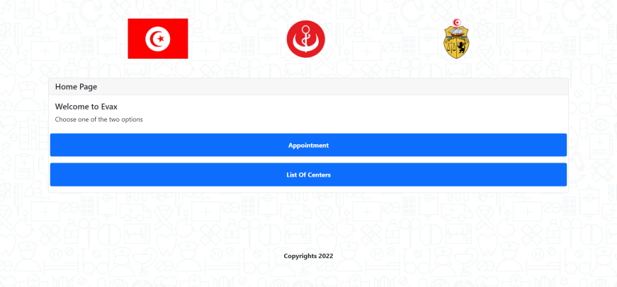
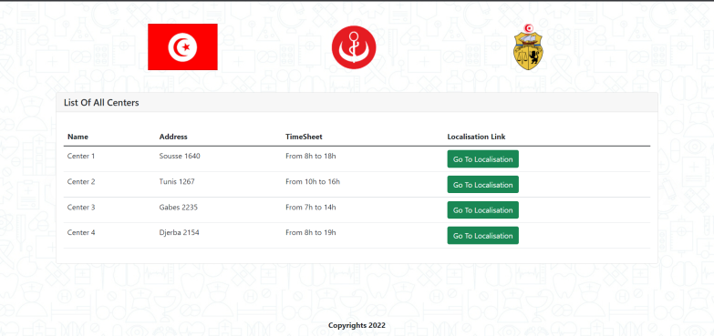
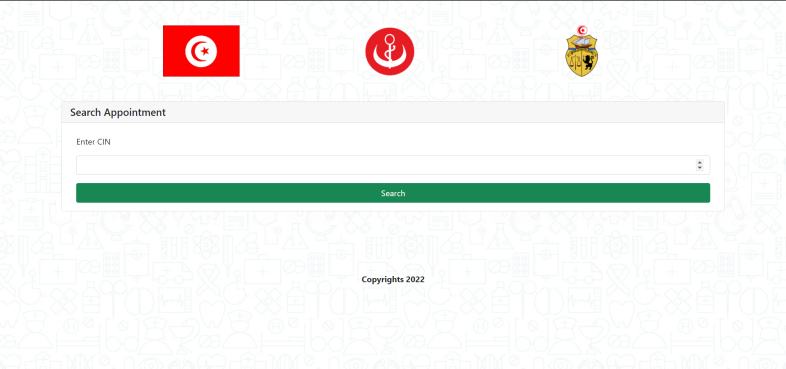
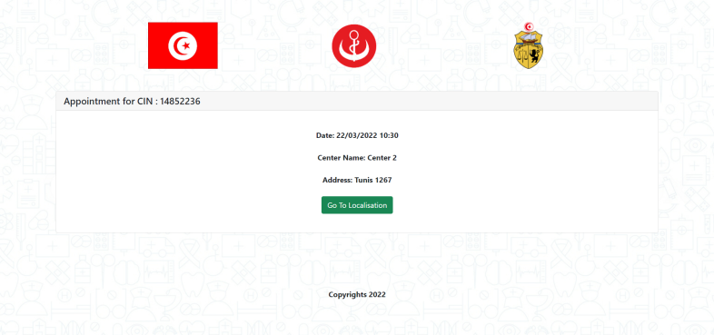

# Project Description : 
This is an angular project following an MVVM architectural pattern, 
This is a solution for the third question of this Lab (Lab2 - MV* Architectures) : 
https://insatunisia.github.io/TP-ArchLog/tp2/index.html

# Uses Cases :
  - List all Vaccination centers
  - Search for appointment

#  Architecture : 
### 1) why do we need Architecture ?
If we don't use architecture, we might fall under the risk of writing our codes in an unorganized pattern. This might increase the number of lines of code, making it difficult to understand. It also decreases readability and increases the number of bugs. So, to provide clear data flow which increases robustness, scalability, bug resistance, increases readability, we should use proper architecture, suitable to work in a team.
The architectural patterns provide the best practices and play a significant role in application development. These patterns are designed to simplify complex codes and make the UI code cleaner and manageable.

### 2) Architecture Patterns : 
The software architectural design pattern ensures organized programming. It also separates application functionality which is easy to test and provides low-cost maintenance. MVC, MVP & MVVM are some popular architecture patterns that companies follow for mobile & web app development.

### 3) Architectural choice : 
After comparing the different architectures we choose to work with the Model View ViewModel  "MVVM" wich is know as being the most well-organized and most reusable way to organize the code. In the MVVM pattern, we find ** two-way data binding ** between View and View-Model. The MVVM pattern organizes and structures the codes into maintainable and testable applications. This has the advantages of easier testing and modularity, while also reducing the amount of glue code that one has to write to connect the view + model.

The Model-View-ViewModel (MVVM) pattern helps to cleanly segregate the business and presentation logic of any application from its user interface (UI).  This helps to address a number of development issues that make an application easier to test, maintain, and evolve. It also greatly improves code reuse opportunities and allows developers and UI designers to collaborate easily when developing their respective parts of an app.

We have three core components in the MVVM pattern: the model, the view, and the view model. 

### - Model
The model is the actual data and/or information that the developers and designers deal with. It is referred to as the domain object. An example of a model could be a contact or the characteristics of a live streaming publishing point.

Model is something that holds the information, but not behaviors or services that manipulate the information. Model classes are usually used in conjunction with services that enclose data access and caching.

### - View
The view is only thing the end user actually interacts with. The view takes certain liberties to make the data more presentable. The view is active in MVVM in comparison to a passive view which has no idea of the model and is completely manipulated by a controller/presenter.

The view in MVVM has behaviors, events, and data-bindings that ultimately require knowledge and idea of the underlying model and ViewModel. The view is not responsible for maintaining its state. Instead, it synchronizes with the ViewModel. A view also has behaviors associated with it, such as accepting user input.

### - View Model
The View Model is ideally a model for the View of the app. The ViewModel is a key component of the triad as it introduces Presentation Separation. It is the concept of keeping the nuances of the view separate from the model. Instead of making the Model informed about the user's view of date, it converts the date to the display format.

It is responsible for coordinating the view's interactions with any model classes that are required. The properties and commands that the view model provides characterize the functionality to be offered by the UI.

# ScreenShots : 
- Home Page : 

- List all Vaccination centers :

- Search Appointment : 

- Appointment : 

# Project Made by :
  - Bacem Ben Daly
  - Mrabet Chouaib

